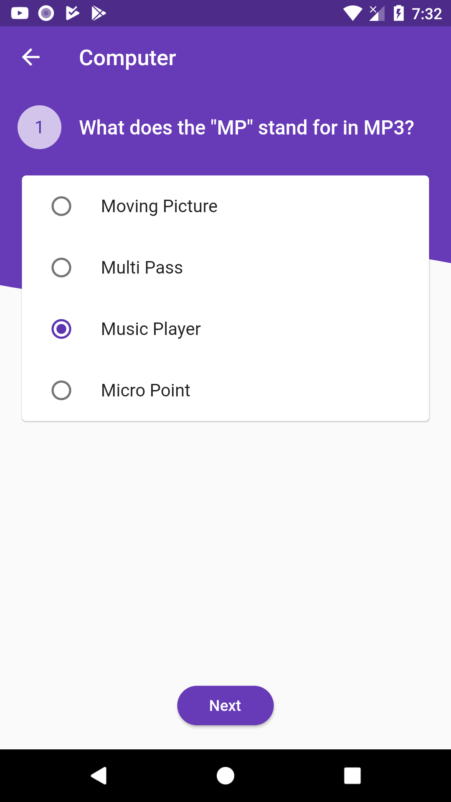
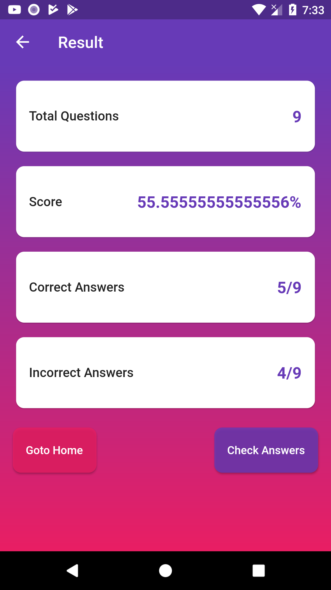
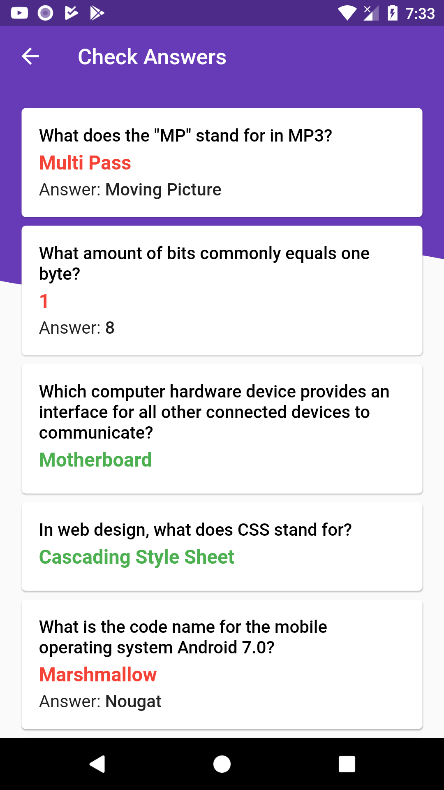

# OpenTrivia
A quiz app in flutter using the [open trivia api](https://opentdb.com)

## Libraries used
- [Font Awesome Flutter](https://pub.dev/packages/font_awesome_flutter)
- [Flutter Custom Clippers](https://pub.dev/packages/flutter_custom_clippers)
- [Html Unescape](https://pub.dev/packages/html_unescape)
- [Auto Size Text](https://pub.dev/packages/auto_size_text)

## Screenshots
    

## To-do

 * Design an API similar to open trivia

 * We will change the `lib/resources/api_provider.dart` -> here, we'll use our own api, similar to open trivia api for our own quiz app.